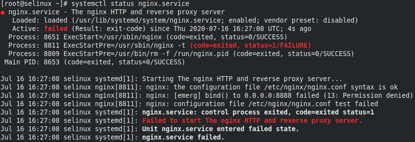
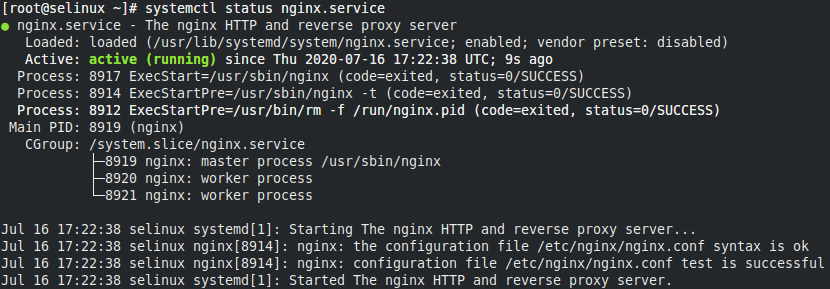
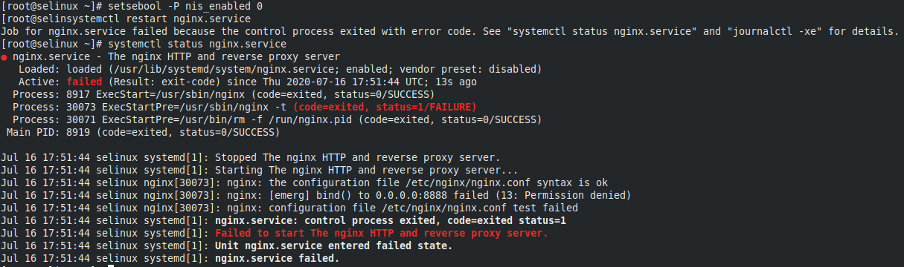
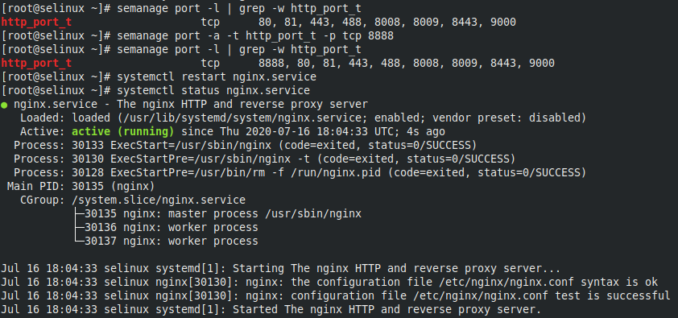
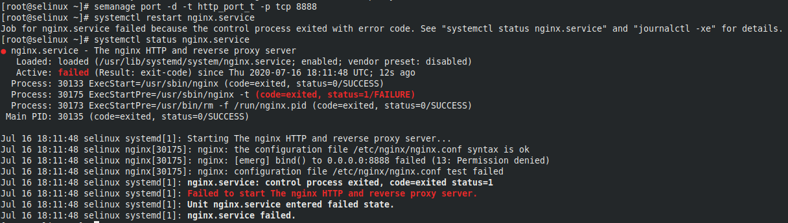
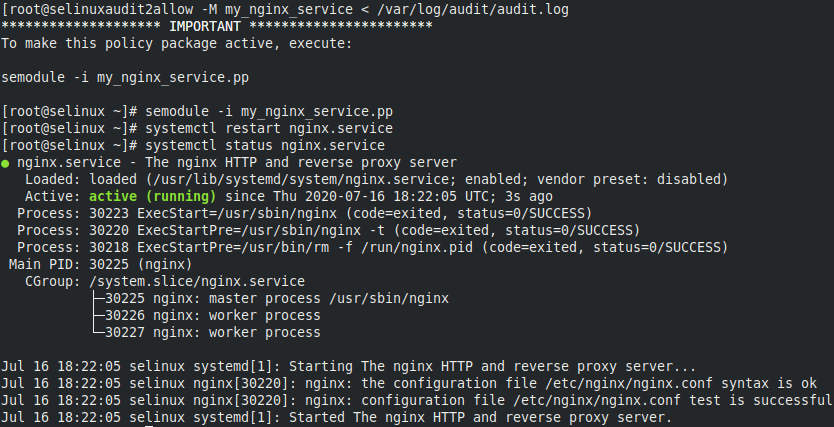
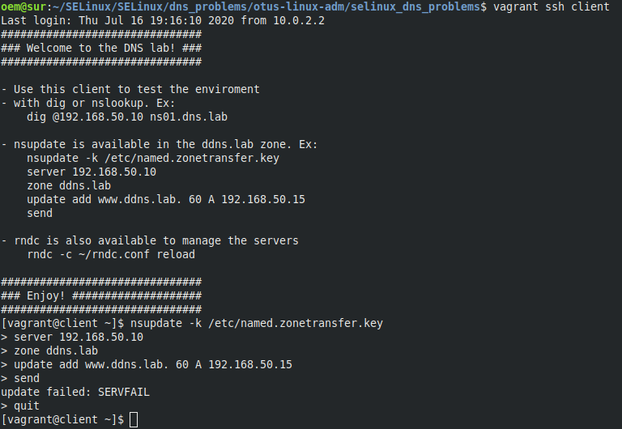

README.md
# Практика с SELinux

## Задача 1

Запустить nginx на нестандартном порту 3-мя разными способами.

Для выполнения задачи разворачивается машина с помошью Vagrantfile со всеми необходимыми инструментами в provision.
Далее меняется порт nginx на нестандартный и после его перезапуска получаю ошибку.


**1 способ решить задачу**

C помощью переключателя `setsebool` командой `setsebool -P nis_enabled 1` Флаг -P используется для внесения изменений на постоянной основе.

После перезапуска nginx, полчил необходимый результат.


**2 способ решить задачу**

Добавление нестандартного порта в имеющийся тип

Вернул значение переключателя `nis_enabled` и перезапустил nginx. Убедился что он не запускается.


Вывел список разрешенных SELinux'ом портов для типа http_port_t:

```
[root@selinux ~]# semanage port -l | grep -w http_port_t
http_port_t                    tcp      80, 81, 443, 488, 8008, 8009, 8443, 9000
```

Видно, что порта 8888 в списке нет. Добавил его:

```
[root@selinux ~]# semanage port -l | grep -w http_port_t
http_port_t                    tcp      8888, 80, 81, 443, 488, 8008, 8009, 8443, 9000
```

Перезапустил nginx и проверил



**3 способ решить задачу**

Формирование и установка модуля SELinux

Сначала удалил порт из разрешённых и перезапустил nginx

> semanage port -d -t http_port_t -p tcp 8888



Для формирования и установки модуля SELinux использовал утилиту `audit2allow`, перенаправив на её stdin лог SELinux:

```
[root@selinuxaudit2allow -M my_nginx_service < /var/log/audit/audit.log
******************** IMPORTANT ***********************
To make this policy package active, execute:

semodule -i my_nginx_service.pp
```

В результате создан модуль `my_nginx_service.pp`, который установил следующим образом:

>[root@selinux ~]# semodule -i my_nginx_service.pp

Перезапустил nginx и проверил



___

## Задача 2

**Обеспечить работоспособность приложения при включенном selinux**

На стенде https://github.com/mbfx/otus-linux-adm/blob/master/selinux_dns_problems/ выяснить причину неработоспособности механизма обновления зоны.

С клиента попытался выполнить обновление зоны ddns.lab

>[vagrant@client ~]$ nsupdate -k /etc/named.zonetransfer.key



Проверил ошибки в логе SELinux:

>cat /var/log/audit/audit.log | grep denied

```
[root@client ~]# cat /var/log/audit/audit.log | grep denied
[root@client ~]# 

```
