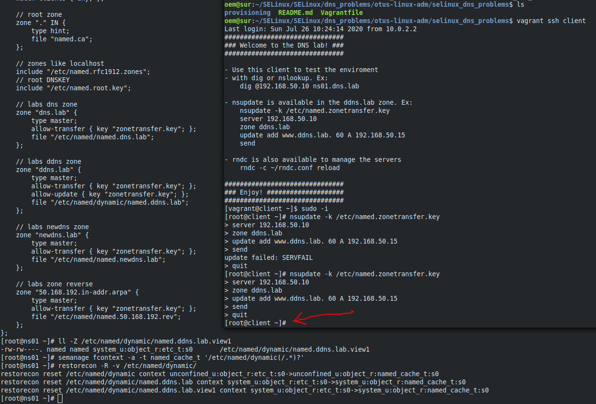

README.md
# Практика с SELinux

## Задача 1

Запустить nginx на нестандартном порту 3-мя разными способами.

Для выполнения задачи разворачивается машина с помошью Vagrantfile со всеми необходимыми инструментами в provision.
Далее меняется порт nginx на нестандартный и после его перезапуска получаю ошибку.


**1 способ решить задачу**

C помощью переключателя `setsebool` командой `setsebool -P nis_enabled 1` Флаг -P используется для внесения изменений на постоянной основе.

После перезапуска nginx, полчил необходимый результат.


**2 способ решить задачу**

Добавление нестандартного порта в имеющийся тип

Вернул значение переключателя `nis_enabled` и перезапустил nginx. Убедился что он не запускается.


Вывел список разрешенных SELinux'ом портов для типа http_port_t:

```
[root@selinux ~]# semanage port -l | grep -w http_port_t
http_port_t                    tcp      80, 81, 443, 488, 8008, 8009, 8443, 9000
```

Видно, что порта 8888 в списке нет. Добавил его:

```
[root@selinux ~]# semanage port -l | grep -w http_port_t
http_port_t                    tcp      8888, 80, 81, 443, 488, 8008, 8009, 8443, 9000
```

Перезапустил nginx и проверил


**3 способ решить задачу**

Формирование и установка модуля SELinux

Сначала удалил порт из разрешённых и перезапустил nginx

> semanage port -d -t http_port_t -p tcp 8888


Для формирования и установки модуля SELinux использовал утилиту `audit2allow`, перенаправив на её stdin лог SELinux:

```
[root@selinuxaudit2allow -M my_nginx_service < /var/log/audit/audit.log
******************** IMPORTANT ***********************
To make this policy package active, execute:

semodule -i my_nginx_service.pp
```

В результате создан модуль `my_nginx_service.pp`, который установил следующим образом:

>[root@selinux ~]# semodule -i my_nginx_service.pp

Перезапустил nginx и проверил


___

## Задача 2

**Обеспечить работоспособность приложения при включенном selinux**

На стенде https://github.com/mbfx/otus-linux-adm/blob/master/selinux_dns_problems/ выяснить причину неработоспособности механизма обновления зоны.

С клиента попытался выполнить обновление зоны ddns.lab

>[vagrant@client ~]$ nsupdate -k /etc/named.zonetransfer.key


Проверил ошибки в логе SELinux:

>cat /var/log/audit/audit.log | grep denied

```
oem@sur:~/SELinux/SELinux/dns_problems/otus-linux-adm/selinux_dns_problems$ vagrant ssh ns01
Last login: Thu Jul 16 19:09:46 2020 from 10.0.2.2
[vagrant@ns01 ~]$ sudo -i                                                  
[root@ns01 ~]# cat /var/log/audit/audit.log | grep denied
type=AVC msg=audit(1595012499.131:1103): avc:  denied  { create } for  pid=741 comm="isc-worker0000" name="named.ddns.lab.view1.jnl" scontext=system_u:system_r:named_t:s0 tcontext=system_u:object_r:etc_t:s0 tclass=file permissive=0
type=AVC msg=audit(1595013089.522:1106): avc:  denied  { create } for  pid=741 comm="isc-worker0000" name="named.ddns.lab.view1.jnl" scontext=system_u:system_r:named_t:s0 tcontext=system_u:object_r:etc_t:s0 tclass=file permissive=0
type=AVC msg=audit(1595013400.030:1107): avc:  denied  { create } for  pid=741 comm="isc-worker0000" name="named.ddns.lab.view1.jnl" scontext=system_u:system_r:named_t:s0 tcontext=system_u:object_r:etc_t:s0 tclass=file permissive=0
type=AVC msg=audit(1595759146.033:710): avc:  denied  { create } for  pid=745 comm="isc-worker0000" name="named.ddns.lab.view1.jnl" scontext=system_u:system_r:named_t:s0 tcontext=system_u:object_r:etc_t:s0 tclass=file permissive=0
type=AVC msg=audit(1595759768.325:736): avc:  denied  { create } for  pid=745 comm="isc-worker0000" name="named.ddns.lab.view1.jnl" scontext=system_u:system_r:named_t:s0 tcontext=system_u:object_r:etc_t:s0 tclass=file permissive=0
```

Из файла `/etc/named.conf` можно вяснить, расположение файла для зоны ddns.lab

```
    // labs ddns zone
    zone "ddns.lab" {
        type master;
        allow-transfer { key "zonetransfer.key"; };
        allow-update { key "zonetransfer.key"; };
        file "/etc/named/dynamic/named.ddns.lab";
```

Просмотр файла с ключём `-Z` покажет контекст безопасности

```
[root@ns01 ~]# ll -Z /etc/named/dynamic/named.ddns.lab.view1
-rw-rw----. named named system_u:object_r:etc_t:s0       /etc/named/dynamic/named.ddns.lab.view1
```

Тип контекста безопасности - `etc_t`.
Для решения задачи необходимо тип поменять на `named_cache_t`.

```
[root@ns01 ~]# semanage fcontext -a -t named_cache_t '/etc/named/dynamic(/.*)?'
[root@ns01 ~]# restorecon -R -v /etc/named/dynamic/
restorecon reset /etc/named/dynamic context unconfined_u:object_r:etc_t:s0->unconfined_u:object_r:named_cache_t:s0
restorecon reset /etc/named/dynamic/named.ddns.lab context system_u:object_r:etc_t:s0->system_u:object_r:named_cache_t:s0
restorecon reset /etc/named/dynamic/named.ddns.lab.view1 context system_u:object_r:etc_t:s0->system_u:object_r:named_cache_t:s0
```

После чего можно повторить попытку обновления зоны ddns.lab.

```
[vagrant@client ~]$ sudo -i
[root@client ~]# nsupdate -k /etc/named.zonetransfer.key
> server 192.168.50.10
> zone ddns.lab
> update add www.ddns.lab. 60 A 192.168.50.15
> send
update failed: SERVFAIL
> quit
[root@client ~]# nsupdate -k /etc/named.zonetransfer.key
> server 192.168.50.10
> zone ddns.lab
> update add www.ddns.lab. 60 A 192.168.50.15
> send
> quit
[root@client ~]# 
```

Ошибки больше нет.


